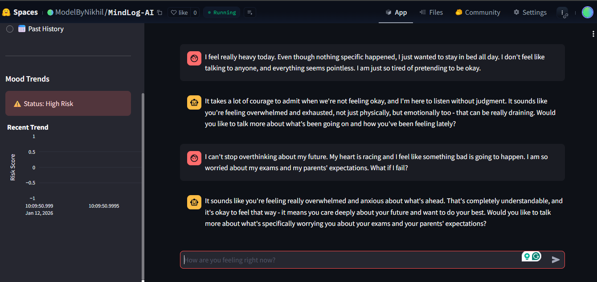

```markdown
# 🧠 MindLog: AI-Powered Mental Health Companion

[](https://www.python.org/)
[](https://streamlit.io/)
[](https://groq.com/)
[](https://huggingface.co/)

**MindLog** is an intelligent journaling assistant that doesn't just listen but understands. It combines **Generative AI (Llama 3)** for empathetic conversation with **Clinical NLP (MentalBERT)** to detect early signs of depression and anxiety trends over time.

---

## 🚀 Key Features

- **💬 Empathetic Companion:** Chat with an AI trained to listen without judgment (Powered by **Llama 3-70B** via Groq).
- **🕵️‍♂️ Silent Depression Detection:** Analyzes user entries in the background using **MentalBERT** to calculate a daily "Risk Score."
- **📊 Mood Analytics:** Visualizes mental health trends over time using interactive **Plotly** graphs.
- **📅 Historical Insights:** Review past conversations and mood logs day-by-day.
- **🔒 Privacy First:** All data is stored locally in an SQLite database.

---

## 🛠️ Tech Stack

| Component | Technology | Description |
| :--- | :--- | :--- |
| **Frontend** | Streamlit | Interactive web UI for chat and dashboard. |
| **LLM** | Llama 3 (Groq API) | Generates human-like, supportive responses. |
| **NLP Model** | MentalBERT | Fine-tuned BERT model for mental health text classification. |
| **Database** | SQLite3 | Stores chat history and daily risk scores locally. |
| **Visualization** | Plotly | Renders dynamic mood trend charts. |

---

## ⚙️ Installation & Setup

Follow these steps to run the project locally:

### 1. Clone the Repository
```bash
git clone [https://github.com/Nikhil-Codehub/MindLog-AI.git](https://github.com/Nikhil-Codehub/MindLog-AI.git)
cd MindLog-AI

```

### 2. Create a Virtual Environment (Recommended)

```bash
python -m venv venv
# Windows
venv\Scripts\activate
# Mac/Linux
source venv/bin/activate

```

### 3. Install Dependencies

```bash
pip install -r requirements.txt

```

### 4. Set up API Keys

Create a `.env` file in the root directory and add your Groq API Key:

```env
GROQ_API_KEY=gsk_your_api_key_here

```

*(Get your free key from [console.groq.com](https://console.groq.com))*

### 5. Run the App

```bash
streamlit run app.py

```

---

## 📂 Project Structure

```bash
MindLog-AI/
├── src/
│   ├── chatbot.py       # Handles Llama 3 API calls
│   ├── model_ai.py      # Hugging Face Emotion/Depression detection logic
│   └── database.py      # SQLite operations (Save/Load chat)
├── app.py               # Main Streamlit Dashboard UI
├── requirements.txt     # Python dependencies
├── .env                 # API Keys (Not uploaded to GitHub)
└── README.md            # Project Documentation

```

---

## 📸 Screenshots

---

## 🔮 Future Improvements

* [ ] **Voice Support:** Allow users to speak their diary entries.
* [ ] **Emergency Alerts:** Hard-coded trigger for helpline numbers if suicide risk is detected.
* [ ] **RAG Integration:** Use Vector DB to remember the long-term context of the user's life.
* [ ] **User Authentication:** Multi-user login system.

---

## 🤝 Contributing

Contributions are welcome! Please fork the repository and create a pull request.

## 📄 License

This project is licensed under the MIT License.

---

**Disclaimer:** *MindLog is an AI tool for self-reflection and screening assistance. It is NOT a substitute for professional medical diagnosis or treatment.*

```

---

### **Final Step: Save & Push (Error Fix)**

Kyunki pichli baar `git push` fail hua tha, ab ye steps follow karein:

1.  **File Save:** Upar wala code `README.md` mein paste karke save karein (`Ctrl+S`).
2.  **Pull (Updates lene ke liye):**
    ```bash
    git pull origin main --allow-unrelated-histories
    ```
    *(Agar editor khule toh `:q` dabayein).*
3.  **Push (Code bhejne ke liye):**
    ```bash
    git add README.md
    git commit -m "Fixed README formatting"
    git push -u origin main
    ```

Ab GitHub check karein, aapka project ekdam professional dikhega! 🚀

```
